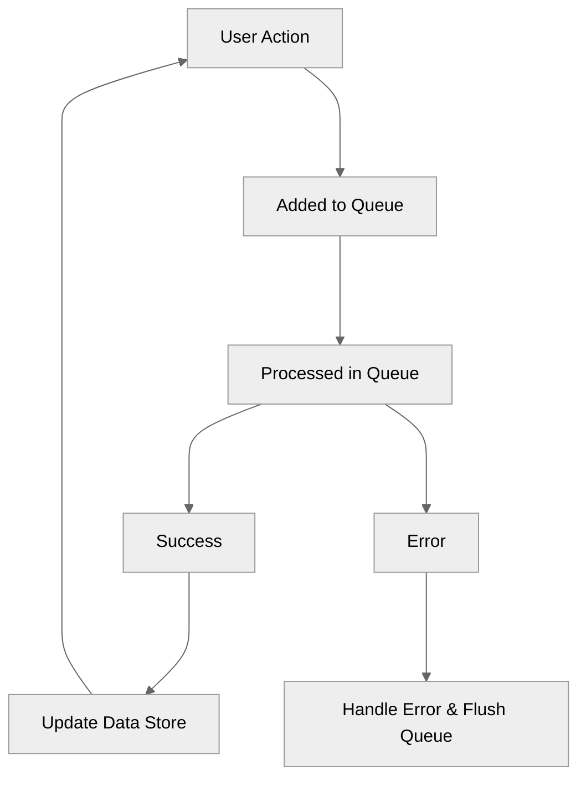

When working on projects that require a lot of user interaction that depend on a server response, I've ran into 3 major problems: the server response is slow, consecutive calls to the API can resolve unexpectedly (causing a race condition), and error handling is tedious. To try to address these problems I've tried a few things. First for the race condition problem
I've tried implementing a debounce, but that still inevitably results in a laggy experience for the user.  For server response times I've tried optimizing endpoints, but at the end of the day you're still at the mercy of your users' internet connection. Lastly for error handling, I haven't found a great solution because of the unpredictability of the server calls, I'm not sure which error came first and how to handle it.

## Brainstorming a solution
When thinking through this problem and the issues that I was facing I wanted to take a step back and start from square 1. I decided that the system and solutions I had in place were fundamentally flawed and looking at this problem from a different lens would be the most productive way of finding a solution that covered every case.

### Solving slow server response
The project I was looking to implement this solution for a shopping cart on an e-commerce app. When thinking through the anatomy of the shopping cart and how adds, changes, and deletes occurred, I realized that I had all the information I needed on the client to know what the end result of an action would be. Because the user had to add the product to the cart from a product page, I already knew the price, name, thumbnail, and anything else I would need to display to inform the user that the cart action happened. Then I could do the math for how the add, change, or delete action would effect the cart item's quantity. I realized I could optimistically update the UI before reaching out to the server. This meant that actions happened near-instantaneous, and the slow server response times wouldn't be felt by the user at all.

### Solving the race condition problem
In the cart project, I consistently ran into issues when users mashed the add to cart button, the responses would come back in a different order than the actions that the user took. This meant that you would see the cart quantity jump in ways that didn't make sense. The quantity would go from `1 -> 3 -> 2 -> 4` since the response from the cart was used to inform the UI. This didn't provide a good user experience and when trying to add any large quantity it was super painful for the user. I needed a solution that would guarantee that the responses came back in the same order that the user actions intended. I thought WAY back to CS classes where we had concepts like stacks and queues where functions would get executed as they were added to the queue and then removed once completed. This concept was perfect. I could make a queue that took in each user action and would execute them one at a time without the chance of race condition.

### Solving error handling
Now that I had the queue concept in place and I could guarantee that the user actions got processed on the server in the correct order. Error handling becomes a lot more predictable. Instead of having a response stack like: `success  -> error -> success` because of the race condition, I could now guarantee that it looks like: `success -> success -> error` . I could even take this a step further and flush the queue when an error occurs so that no more actions would ran as it would have likely resulted in an error. This allowed me to have total control and write more bulletproof code to display and handle resolution of any errors that occurred since I knew I would only have to handle one error at a time.

### Conceptualizing a solution
I now had all the pieces of the puzzle, but architecting a solution that would do every one of these things required some upfront planning. I decided to step back and look at the entire life cycle that would need to occur for this to be done properly. I was quickly able to draw conclusions of the steps that needed to happen.

1. The UI would be optimistically updated as the user makes an action
2. The information about that action would need to be put into the queue
3. The queue would process each action
4. Once the action is processed in the queue it would either update the data store with the exact server response or it would inform the user that an error occurred and flush the queue

Now that I had these steps outlined, I wanted to visualize it with a flow chart. I also used this to get buy-in from teammates as illustrating the solution was a lot easier to digest. So here it is!



So now that we have conceptualized what the solution would look like, we need to now think through the implementation details and write some code.

## Building the Queue
For the project I was working on, I was storing the cart inside of React's Context API. I like this pattern as I was able to pull through cart actions into any component without much thought or overhead. I decided that this overarching pattern was fine and I was going to stick with it. So I had to introduce this queue concept into this file. Here's some rough pseudo code to visualize what that file looked like:

```javascript
const Cart = ({children}) => {

	const [state, dispatch] = useReducer(...)

	const addCartItem = async (payload) => {
		const response = await apiCall(payload)
		dispatch({ type: 'UPDATE_CART', response})
	}

	const updateCartItem = async (payload) => {
		const response = await apiCall(payload)
		dispatch({ type: 'UPDATE_CART', response})
	}

	const deleteCartItem = async (payload) => {
		const response = await apiCall(payload)
		dispatch({ type: 'UPDATE_CART', response})
	}

	return (
		<ContextProvider value={{ ...state, addCartItem, updateCartItem, deleteCartItem}}>
			{children}
		</ContextProvider>
	)
}
```

After looking at this file for a bit, I decided that the best way to implement the queue concept was by introducing a custom hook into the Cart component in order to control the lifecycle like we've illustrated.

#### Implementing the useQueue hook
From the get-go I realized I needed 4 main components for this hook to make it function as intended. First, an array that can host each user action (task). Second, a function that will add a task to the queue. Third, a task processor. Lastly, a way to know if the queue has tasks and is currently processing a task. Luckily, React makes this pretty easy as it has a lot of these things out of the box. The array could exists in a useState hook so that way we could add tasks to it while keeping the rest of React's lifecycle in sync, this takes care of the first two. The task processor needs to execute if tasks are in the queue, so this can be a useEffect that has the queue state as a dependency. The last piece of knowing when the queue is processing, this can be another variable in the previously created useState hook so that way all updates are on the same React "thread". Ok, let's write some code.

```javascript
const useQueue = () => {
	const [queue, setQueue] = React.useState({
		tasks: [],
		isProcessing: false
	})

	const addTaskToQueue = React.useCallback((task) => {
		setQueue(prevQueue => ({
			tasks: [...prevQueue.tasks, task],
			isProcessing: prevQueue.isProcessing
		}))
	}, [])

	React.useEffect(() => {
		// Don't do any processing if there are no tasks
		if(queue.tasks.length === 0) return;
		// Don't do any processing if we're already processing
		if(queue.isProcessing) return;

		const currentTask = queue[0]

		setQueue(prevQueue => ({
			tasks: prevQueue.tasks.slice(1),
			isProcessing: true
		}))

		Promise.resolve(currentTask.taskFn())
			   .catch(() => {
				   // Clear the task queue on an error
				   setQueue({
					   tasks: [],
					   isProcessing: false
				   })
			   })
			   .finally(() => {
				   // Set the queue to not processing
				   setQueue(prevQueue => ({
					   tasks: prevQueue.tasks,
					   isProcessing: false
				   }))
			   })
	}, [queue])

	return {
		addTaskToQueue
	}

}
```

Initially, as you can see, there aren't many lines of code here. We're able to keep this really simple by doing one main thing, allowing the `task` to pass in a function (`taskFn`) that when resolved will be notifying the Context Store of the result. This means that the useQueue hook only has one concern, a queue.

We solve the rest of the previously defined issues by adding the useQueue hook to the Cart and adjusting a few things in our approach there. Here's that code.


```javascript
const Cart = ({children}) => {

	const [state, dispatch] = useReducer(...)
	// Adding a toast hook to display errors to the user
	const toast = useToast()

	// The use queue hook that we previously wrote
	const { addTaskToQueue } = useQueue()

	const addCartItem = async (payload) => {
		const prevCart = state.carts;

		const optimisticallyUpdatedCart = { items: [payload, ...prevCart.items]}

		// Update the cart with the optimistic payload we created
		dispatch({ type: 'UPDATE_CART', payload: optimisticallyUpdatedCart })

		addTaskToQueue({
			taskFn: async () => {
				// Make the server call
				const response = await apiCall(payload)

				if(!response.success){
					// Display error to the user
					toast.error(response.errorMessage)

					// If the server gives us an updated cart, regardless of
					// error we can update the store with that cart.
					if(response.cart){
						dispatch({ type: 'UPDATE_CART', payload: response.cart})
						return;
					}
					// If the server gives us nothing helpful, reset the store
					// to the previous cart.
					if(!response.cart){
						dispatch({ type: 'UPDATE_CART', payload: prevCart})
						return;
					}
				}

				// Upon successful cart action, update the cart store with
				// the server response.
				dispatch({ type: 'UPDATE_CART', paylaod: response.cart})
			}

		})
	}

	const updateCartItem = async (payload) => {
		// repeat of addCartItem with optimistic update logic
		// written for a cart item update
	}

	const deleteCartItem = async (payload) => {
		// repeat of addCartItem with optimistic update logic
		// written for a cart item delete
	}

	return (
		<ContextProvider value={{ ...state, addCartItem, updateCartItem, deleteCartItem}}>
			{children}
		</ContextProvider>
	)
}
```

Looking at the updated `addCartItem` function, we can now see that what we set out to do is happening.
1. The cart is instantly updated with an optimistic update
2. The individual action is added to the queue and processed
3. Errors are handled. We got some more bang for our buck here depending on the server response with the ability to revert the cart back to it's previous state if there is nothing returned, or use the cart response if there is.
4.  Cart gets updated with server response once processed.

## In conclusion
This project specifically hit a lot of points home for me. First being that when setting out to do something that's "complicated", defining the issue, the output of the solution, and taking the time to visualize, helps to create as well thought out and simple solution. It also reminded me about how important it is to understand how data structures and CS concepts can be super powerful when used correctly. Between the utilization of the queue pattern and the dependency injection like pattern for executing the user action in the task queue, implementing those patterns made the overall solution a lot more simple.

Thanks for coming along with me on this journey! It was a lot of fun to write. If you'd like to see more of these types of articles please reach out to me on X (Twitter) [@kpmdev](https://twitter.com/kpmdev) with any subjects or ideas you have, I would love to hear them!
